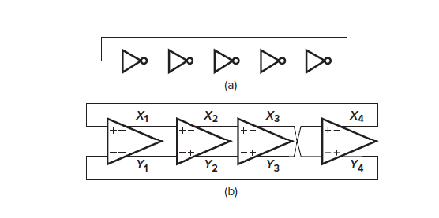
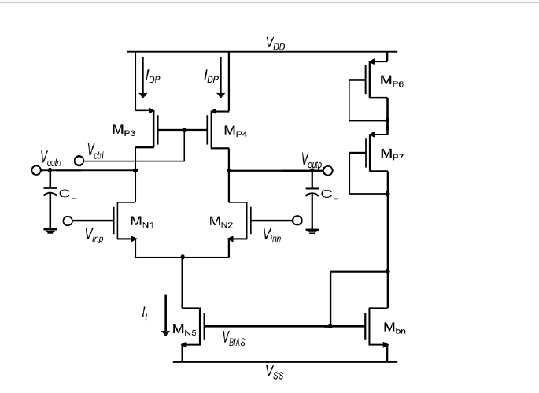
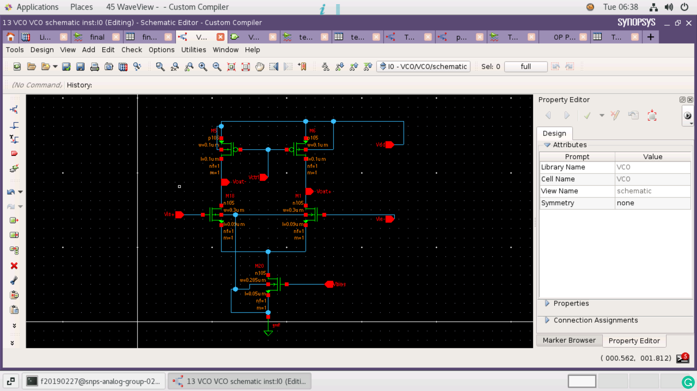
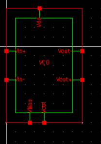
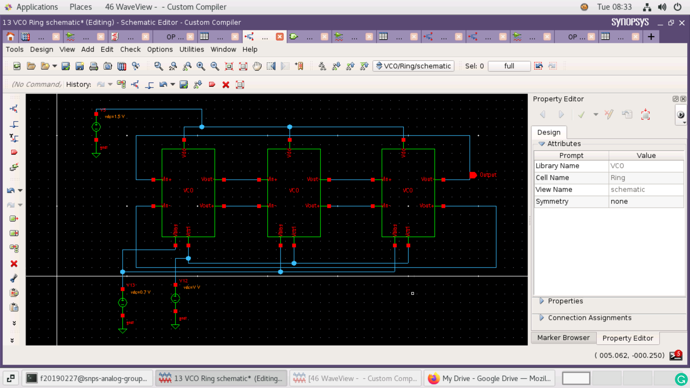
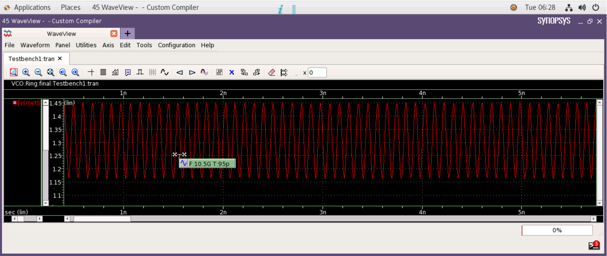
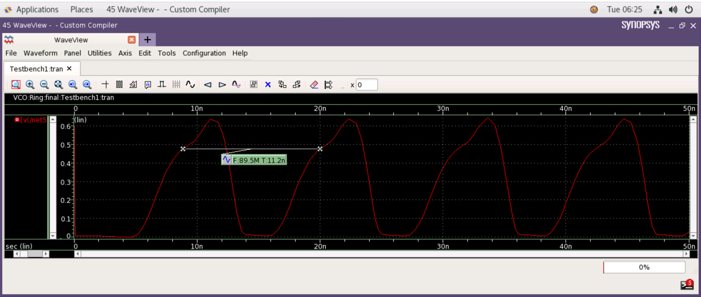
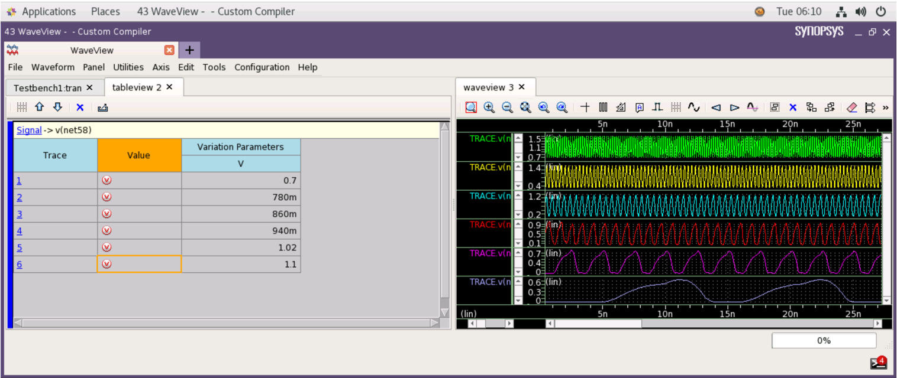
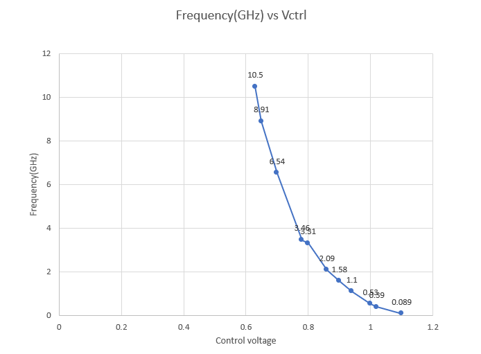
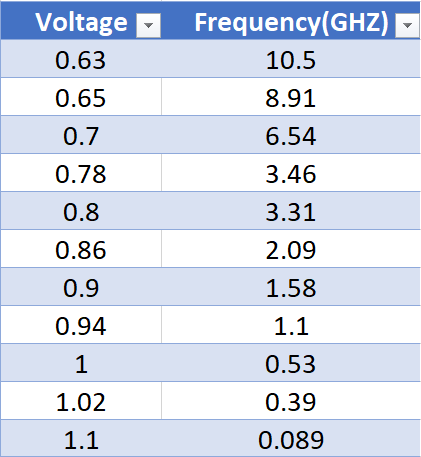

# Voltage Controlled Ring Oscillator with a wide tuning range(90MHz - 10GHz) and high frequency(10.5GHz)

This repo is being formed as a part of analog design hackathon by IITH. Design and results of the VCRO are presented.


# Table of Contents
 * [Introduction](#Introduction)
 * [Tools Used](#Tools-Used)
 * [Design of the Circuit](#Design-of-the-Circuit)
 * [Results](#Results)
 * [Conclusions](#conclusions)
 * [Challenges Faced](#Challenges-Faced)
 * [Future Work](#Future)
 * [Author](#Author)
 * [Acknowledgements](#Acknowledgements)
 * [References](#References)

# Introduction
A ring oscillator is a device composed of an odd number of NOT gates in a ring, whose output oscillates between two voltage levels, representing true and false. The NOT gates, or inverters, are attached in a chain and the output of the last inverter is fed back into the first. Ring oscillators can also be created using analog design, instead of inverters. The analog design in the ring oscillators is used to provide the Voltage control, wide swing. A ring oscillator(Figure 1) consists of a fixed number of gain stages in a
loop. The gain stage could be an inverter, differential pair,
current starved inverter. The main aim of all these individual
stages is to produce an output voltage with a particular
phase and gain such that Barkhausen criteria(shown below)
of oscillations is satisfied.

```
pahse H(jw) = 180
|H(jw)| = 1
```

<p align="center">
  </br>
  Fig. 1: Basic ring oscillators
</p>

# Tools Used

<b>• Synopsys Custom Compiler:</b></br>
&emsp;The Synopsys Custom Compiler™ design environment is a modern solution for full-custom analog, custom digital, and mixed-signal IC design. As the heart of the Synopsys Custom Design Platform, Custom Compiler provides design entry, simulation management and analysis, and custom layout editing features. This tool was used to design the circuit on a transistor level.

<b>• Synopsys Primewave:</b></br>
&emsp;PrimeWave™ Design Environment is a comprehensive and flexible environment for simulation setup and analysis of analog, RF, mixed-signal design, custom-digital and memory designs within the Synopsys Custom Design Platform. This tool helped in various types of simulations of the above designed circuit.

<b>• Synopsys 28nm PDK:</b></br>
&emsp;The Synopsys 28nm Process Design Kit(PDK) was used in creation and simulation of the above designed circuit.

# Design of the Circuit
The circuit was designed with reference to the paper <a href = 'https://www.mdpi.com/2079-9292/8/10/1156'>Design of a Wide-Band Voltage-Controlled Ring Oscillator Implemented in 180 nm CMOS Technology</a>. The circuit is based on a differential pair based individual stage in a ring oscillator. The PMOS M1 and M2 operate in the triode region so that the on resistance could be changed on varying the control voltage. The 2 nmos in the differential pair are the gain components, and the tail MOSFET is used for biasing the circuit. It is worth mentioning that designing
VCOs is a challenge; besides, one can find guidelines to deal with modern design issues, such
as ultra-low-power requirements. Other important applications require robust VCOs, such as in
designing analog-to-digital converters or phase-locked loops. Some VCOs are designed using
complex devices such as negative differential resistances.
The oscillator single gain stage circuit diagram implemented is shown below:
<p align="center">
  </br>
  Fig. 2: Single gain stage given in reference paper
</p>


## Schematic
<p align="center">
  </br>
  Fig. 3: Single gain stage with widths and lengths
</p>

<p align="center">
  </br>
  Fig. 4: Symbol
</p>

<p align="center">
  </br>
  Fig. 5: 3 stage VCRO schematic
</p>


## Calculation of W/L values
> "Analog design is all about calculting dimensions"

> For a ring oscillator to work properly, following conditions must be satisfied
> 1. Gain of each individual stage must be greater than specific value(2 for 3-stages, 1.414 for 4 stages).
> 2. Phase of each individual stage should be 180 degrees.

Considering the above conditions, specifications were decided for a single stage in the following manner:
- Firstly the differential stage was halved, since both the sides are matching. So, we need to design Widths and Lengths for 3 Mosfets only.
- The Gain of single stage will be then given by gm*(ro1 || ro2). So the gm, ro1 and ro2 should be high enough so that gain is greater than 2.
- Operating point and dc analysis was performed for all individual MOSFETs, and gm, gds and Id were observed.
- Setting the widths and lengths according to our requirement of increasing or decreasing the gm and gds.
#### M6(Load Pmos)
```
W = 0.1um
L = 0.1um
Id = 2.5uA
Vgs = controlled
```
#### M1(Gain Nmos)
```
W = 0.3um
L = 0.09um
Id = 2.57uA
gm = 24u(mho)
Vgs = 0.7V
```
#### M20(Tail mosfet)
```
W =  .285um
L = 0.05um
Id = 5.2uA
Vgs(Vbias) = 0.7V
```
## Netlist of the Circuit
```
*  Generated for: PrimeSim
*  Design library name: VCO
*  Design cell name: Ring
*  Design view name: schematic
.lib 'saed32nm.lib' TT
.param V=0.63
*Custom Compiler Version S-2021.09
*Tue Mar  1 08:20:20 2022

.global gnd!
********************************************************************************
* Library          : VCO
* Cell             : VCO
* View             : schematic
* View Search List : hspice hspiceD schematic spice veriloga
* View Stop List   : hspice hspiceD
********************************************************************************
.subckt vco vbias vctrl vdd vin+ vin- vout+ vout-
xm1 vout+ vin- net58 gnd! n105 w=0.3u l=0.09u nf=1 m=1
xm18 vout- vin+ net58 gnd! n105 w=0.3u l=0.09u nf=1 m=1
xm20 net58 vbias gnd! gnd! n105 w=0.285u l=0.05u nf=1 m=1
xm5 vout- vctrl vdd vdd p105 w=0.1u l=0.1u nf=1 m=1
xm6 vout+ vctrl vdd vdd p105 w=0.1u l=0.1u nf=1 m=1
.ends vco

********************************************************************************
* Library          : VCO
* Cell             : Ring
* View             : schematic
* View Search List : hspice hspiceD schematic spice veriloga
* View Stop List   : hspice hspiceD
********************************************************************************
xi2 net48 net10 net18 net55 net62 net51 net58 vco
xi1 net48 net10 net18 net52 net63 net62 net55 vco
xi0 net48 net10 net18 net58 net51 net63 net52 vco
v12 net10 gnd! dc='V'
v13 net48 gnd! dc=0.7
v5 net18 gnd! dc=1.5


.tran '0.001*(50n-0)' '50n' name=tran
.op All 0 name=op

.option primesim_remove_probe_prefix = 0
.probe v(*) i(*) level=1
.probe tran v(net58)

.temp 25

.ic  v(net108)=0  v(net81)=0.6  v(net58)=0.6

.option primesim_output=wdf


.option parhier = LOCAL
.option primesim_keep_0v_dcvs_op = 1

.end
```
# Results
The frequency was showing wide variation from **90MHz to 10GHz**. The plots are shown below:
#### 10 GHz(Vctrl = 0.63V)
<p align="center">
  </br>
  Fig. 6: High frequency
  </p>
 
#### 89 MHz(Vctrl = 1.1V)
<p align="center">
  </br>
  Fig. 7: Low frequency
</p>

#### Parametric analysis
<p align="center">
  </br>
  Fig. 8: Multiple frequency plots for parametric sweep of Vctrl
</p>

#### Frequency vs Control voltage
<p align="center">
  </br>
  Fig. 9: Frequency vs Control Voltage plot
</p>

<p align="center">
  </br>
  Fig. 10: Frequency vs Control Voltage table
</p>


# Conclusions
- The circuit built was up to mark and expextaitions.
- Frequency range came out to be much higher and wider than expected.
- Highest frequency was much higher when compared to 180nm impementation of same circuit.
- Learnt many many new things through this design and implemntation.
# Challenges Faced
- Initially circuit was not oscillating, so to make the circuit oscillate, some initial condition(setup - Convergence Aids - select the output you want) need to be set for making it operating in a loop, otherwise it will simply show a contant value.
# Future Work
- Frequency and FFT plots of the circuit need to be plotted.
- Noise analyisis is not done and phase noise is not calculated.
- Supply voltage was fixed at 1.5 V. Need to reduce it and make it down to 1V.
- Area estimation and layout remains
# Acknowledgements
• <a href='https://www.iith.ac.in/events/2022/02/15/Cloud-Based-Analog-IC-Design-Hackathon/'>Cloud Based Analog IC Design Hackathon</a></br>
• <a href='https://www.synopsys.com/'>Synopsys India</a></br>
• <a href='https://www.vlsisystemdesign.com/'>VLSI System Design (VSD) Corp. Pvt. Ltd India</a></br>

# References
1. Design of Analog CMOS integrated circuits, B. Razavi.
2. Design of Analog Pjhase locked loops, B. Razavi.
3. Design of a Wide-Band Voltage-Controlled Ring Oscillator Implemented in 180 nm CMOS Technology by Esteban Tlelo-Cuautle
